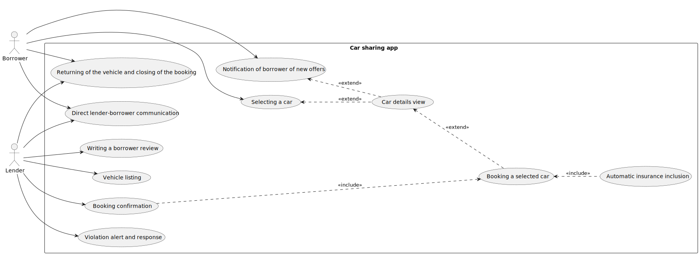

# Carsharing App

## Vision

The Carsharing App connects car owners (lenders) with individuals who need temporary access to a vehicle (borrowers). The platform facilitates the rental process, ensuring security and convenience for both parties. Lenders can earn money from their idle cars, while borrowers can access vehicles without the long-term commitment of ownership.

### Stakeholders
The main stakeholders in the carsharing app are lenders and borrowers.

---

### Problems

#### Lender
Lenders want their cars to be utilized instead of sitting idle. They are not earning money from unused cars, and over time, the cars depreciate in value.

#### Borrower
Borrowers do not own cars but need them occasionally, such as for larger shopping trips or outings. They prefer not to deal with car maintenance, technical inspections, or mandatory insurance.

---

### Benefits

#### Lender
Lenders do not need to worry about the trustworthiness of borrowers because the platform ensures security. Any fines incurred are handled by the platform, which then charges them to the borrower. Additionally, lenders can set specific conditions for car usage, such as limiting driving distance, restricting foreign travel, or prohibiting highway or off-road driving.

#### Borrower
Borrowers do not need to worry about the trustworthiness of lenders. They receive detailed information about the car's condition, whether it is old and cheap or new and expensive, allowing them to make informed decisions.

## Architecture
### Usecases

