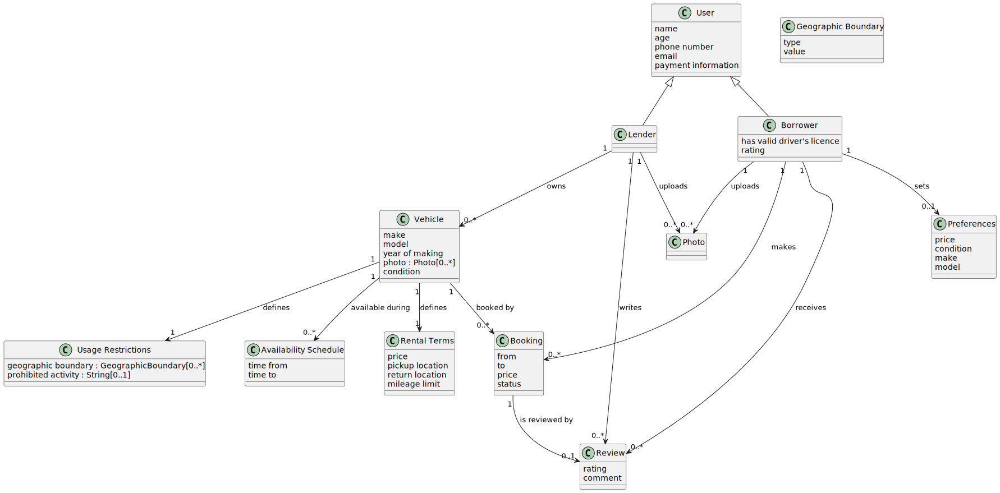

# Clases

### User
A base class for all system users.

### Lender
A specialized user who offers vehicles for rent.

- Owns vehicles.
- Writes reviews about borrowers.

### Borrower
A specialized user who rents vehicles.

- Makes bookings.
- Receives reviews from lenders.
- Can set preferences  for searching vehicles.

### Vehicle
Representation of a vehicle available for rent.

- Can be booked ([Booking](#booking)).
- Defines [UsageRestrictions](#usagerestrictions)
- Has [Rental Terms](#rental-terms) and [Availability Schedule](#availability-schedule)

### Booking
Represents a reservation of a vehicle for a specific time period.

- Created by a borrower.
- Linked to a specific vehicle.
- May be associated with a review.

### Review
A review written by a lender about a borrower after a rental.
- Belongs to exactly one booking.
- Links one lender and one borrower.

### Preferences
Settings that define a borrower's vehicle search criteria.

### Rental Terms
Conditions under which a vehicle is rented.

### Usage Restrictions
Defines restrictions for vehicle usage.

### Availability Schedule
Specifies when a vehicle is available for booking.